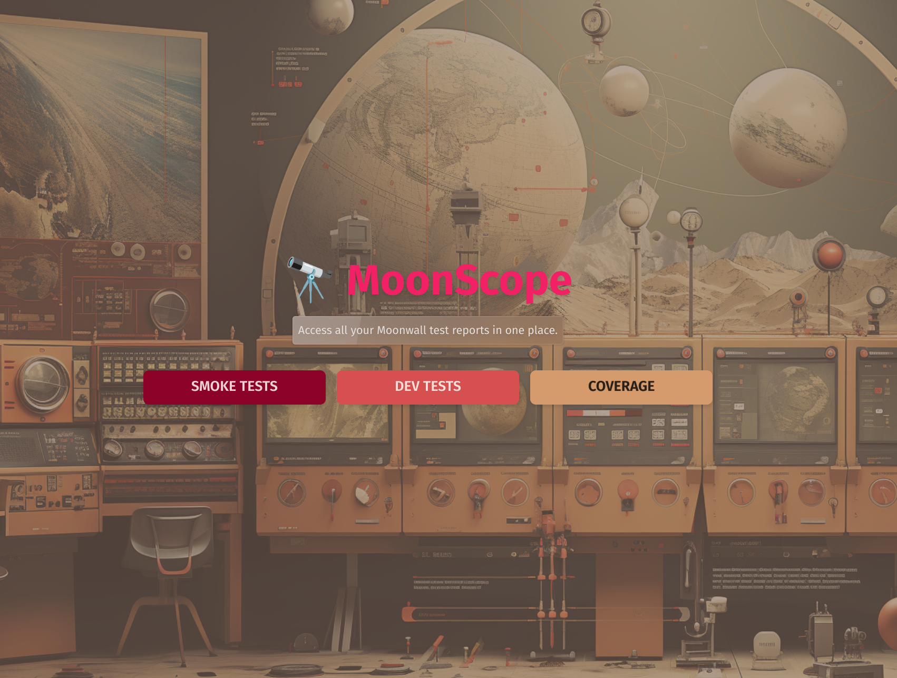

# 🔭 MoonScope



## 📖 Introduction

MoonScope is a test report aggregator, which combines Moonwall, to provide an entirely server side rendered application for viewing and exploring test reports. With a focus on speed and scalability, it is designed to be able to handle thousands of test reports, and provide a simple interface to explore them. There is no client side state or rendering, and plain HTML only is served to the client via AJAX calls.

## Preqrequisites

> [!IMPORTANT]  
> This assumes you already have a [PostgreSQL](https://www.postgresql.org/) database to connect to. You can create your own local one, or connect to a remote one - but that's left upto you to decide!

This relies on connecting to a Postgres database via the standard PostgreSQL env vars.
You can set this in a `.env` file in the root of the project, or in your shell environment.

```bash
PGHOST=localhost
PGPORT=5432
PGDATABASE=postgres
PGUSER=postgres
PGPASSWORD=postgres

MOONSCOPE_TOKEN=21312312easwdasd2e13e12
LOCAL_DB=true
```

> [!NOTE]  
> `MOONSCOPE_TOKEN` is the primitive precursor to access control, which is a simple token to determine if you can insert into the DB or not. This is a temporary solution, and will be replaced with a proper authentication system in the future.
> [!NOTE]  
> `LOCAL_DB` controls whether the connection should be using SSL or not. If you're using a local DB, you can set this to `true` to disable SSL exception.

## 📍 Instructions (Using Local)

### 1. Install Bun

```bash
curl -fsSL https://bun.sh/install | bash
```

### 2. Install dependencies

```bash
bun install
```

### 3. Run the server

The following command will launch both the API (3001) as well as the webhosting server (3000).

```bash
bun start
```

> [!NOTE]  
> If you are developing this you can use `bun dev` to have it use hot-reloads as you type. This will be hammer the DB with reconnection requests though, so it's recommended to test against a local postgres DB.

## 🐳 Instructions (Using Docker)

### 1. Build the image

In this directory, run:

```bash
sudo docker build -t moonscope .
```

This will create a docker image called `moonscope` with the latest version of the code.

### 2. Mounting the image

```bash
sudo docker run --env-file .env -p 3000:3000 -p 3001:3001 -d moonscope
```

> [!NOTE]  
> If you are connecting to a local DB, you will need to add the option `--network host` in order to expose the localhost of the host machine to the container.

## Interacting with the API and GUI

Open http://localhost:3000/ with your browser to see the main page. It is currently hardcoded to serve up smoke_reports, dev_reports and coverage.

There are currently 3 API endpoints:

- GET `/fetch`: Fetches all values from a table specified in the headers. If no table name is provided, it returns an error.
- GET `/fetch/:id` : Fetches a specific entry by ID from a table specified in the headers. Returns the data or a "NOT FOUND" message.
- POST `/insert`: Inserts new data into the table specified in the headers. The data to be inserted must adhere to the TestDataSchema format.

---

## Why Bun, Elysia and HTMX?

The intention is to host a centralized repository of test reports. With a simplistic implementation this would be sufficient for small quantities - but with many thousands of runs, any client side rendering would impact the ability to scale the application. As such the tech stack chosen here is to allow for a server side rendered application, with the ability to scale horizontally.

Fun fact, we use page transitions to make it feel like a single page application, but it's actually just a bunch of pages stitched together with HTMX.
